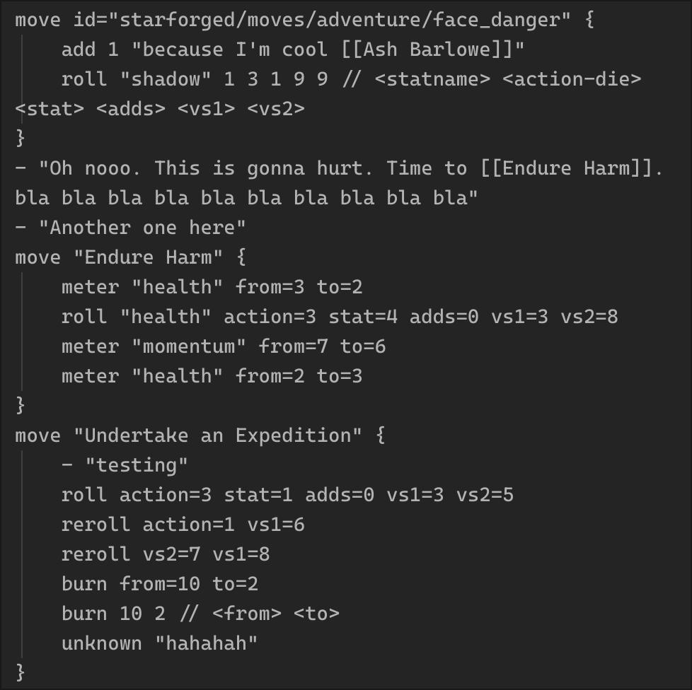

# Obsidian Forged

Obsidian plugin to play Ironsworn/Starforged system games, using the data in
[datasworn](https://github.com/rsek/datasworn) format.

This owes a lot to [Eric Bright's Forged_in_Obsidian](https://github.com/ericbright2002/Forged_in_Obsidian)
template vault. I started with that vault and then gradually replaced functionality
with this plugin.

## Features

See the test vault for examples of characters, progress tracks, clocks, etc. Also
see the [caveats](#caveats) for known issues/missing functionality.

- Pulls oracle, move, and asset data from datasworn files
  - Supplemental files can be added to the repo, to, e.g., add custom oracles
- Oracles
  - Roll on oracle tables with "Ask the Oracle" command
  - Generate complete entities (planets, NPCs, etc) using the "Generate an Entity" command
- Characters
  - Currently only supports one character (but built to eventually support multiple)
  - All character attributes are in YAML frontmatter
  - Use "Take on a Meter" / "Suffer on a Meter" commands to modify meters
- Moves
  - Trigger a move with the "Make a Move" command
    - Action rolls and progress rolls both supported and pull from character/progres track
      metadata
    - If your momentum could improve an action roll, you'll be prompted to burn momentum
  - Moves are rendered into custom move blocks as YAML/custom DSL
- Progress Tracks and Clocks: Each clock / progress track is kept in a file, using frontmatter
  to record progress, etc.

## Installing the plugin

For now, the easiest way to install is via [BRAT](https://tfthacker.com/brat-plugins).
You should be able to add this repo to BRAT, and it will install the latest release
of this plugin.

If you want to install from source,

To build the code and copy it to your vault, put the vault's plugin path
(`path/to/vault/.obsidian/plugins`) in a `.targetdir` file, and then run:

```bash
pnpm install && pnpm copy:target
```

You should then be able to enable the plugin in your vault (after
restarting/reloading Obsidian)

## Using the plugin

The mechanics renderer works regardless of how your vault is set up. For now, to
use the commands for mechanics (make a move, take/suffer on a meter, etc), you
also need a character. See [the example character](./test-vault/characters/Ash%20Barlowe.md)
for a template.

Other functionality (such as custom oracles) also have examples in the [test vault](./test-vault/).

## Development

To play around, you can run `pnpm dev`, which watches for code changes, compiles,
and then deploys into the test vault. You can open up the test-vault in obsidian
and, with the hot-reload plugin enabled, new updates will be loaded automatically.

## Caveats

Biggest caveat is that this is a moving target and the file formats may change.
I have a bunch of stuff in the existing format, so I'm trying to be backwards
compatible.

A bunch of stuff is missing right now:

- I haven't tested with Ironsworn at all-- the Starforged data is bundled right now
  but eventually I'll make it a download?
- Asset meters aren't currently modifiable/rollable (but this is next up)
- Probably a dozen other signficant things I can't think of

### Mechanic Code Fences

This plugin renders a [KDL](https://kdl.dev/) block into a formatted
Ironsworn/Starforged mechanics block, with nice styling and all that.

It takes an Obsidian note that looks like this:



and turns it into this:


Most mechanics nodes accept arguments either as properties, or BOA (by order of arguments).

That is, a node with arguments `a`, `b`, and `c` can be written as:

```kdl
node 1 2 3
```

or as:

```kdl
node a=1 b=2 c=3
```

Exceptions are noted in node documentation with ("not BOA").

Some arguments also support markdown rendering, and are marked as `md`.

#### `move`

Declares a new move. Can contain any other nodes except for `move`. Shows
icons for hit kind and whether there was a match, and can be expanded or
collapsed to show or hide the contained nodes.

##### Arguments

- `id` (optional): datasworn ID of the move
- `name` (optional, md): the name of the move

##### Children

Any node, except for `move`.

##### Example

````kdl
```mechanics
move "Face Danger" {
    roll action=6 stat=3 adds=0 vs1=8 vs2=9
    - "ouch"
}
move "Endure Harm" {
    meter "health" from=3 to=2
    roll action=3 stat=4 adds=0 vs1=3 vs2=5
}
```
````

#### `-` (dash)

Adds an "arbitrary" text entry under the move. You can put anything in here.

(BOA only)

##### Arguments

- `text` (md): the text to display

##### Example

```kdl
- "Oh man that was interesting"
```

#### `roll`

Adds a regular roll to the move. If used inside a `move` block, will set its
result.

##### Arguments

- `stat-name` (optional): the name of the stat to roll against
- `action`: the value of the action die
- `stat`: the value of the stat to add
- `adds` (optional, default: 0): the total value of the adds
- `vs1`: the first challenge die
- `vs2`: the second challenge die

##### Example

```kdl
// This will be rendered as a Weak Hit
roll "heart" action-die=3 stat=2 adds=1 score=6 challenge1=3 challenge2=7
```

#### `progress-roll`

Renders a progress roll. If used inside a `move` block, will set its result.

##### Arguments

- `score`: the number of filled track boxes the progress move is rolling against
- `vs1`: the first challenge die
- `vs2`: the second challenge die

##### Example

```kdl
// This will render as a Miss on progress
progress-roll score=5 challenge1=6 challenge2=7
```

#### `reroll`

Rerolls one or more dice from a previous roll. If used inside a move, the
move's result will be automatically updated.

(not BOA)

##### Arguments

- `action` (optional): the new value of the action die
- `vs1` (optional): the new value of the first challenge die
- `vs2` (optional): the new value of the second challenge die

##### Example

```kdl
move "Face Danger" {
    // weak hit (score = 6)
    roll action=3 stat=2 adds=1 vs1=3 vs2=7

    // strong hit (score = 9)
    reroll action=6 vs1=5
}
```

#### `meter`

Shows meter changes.

##### Arguments

- `name`: the name of the meter (e.g. "health")
- `from`: the starting value of the meter
- `to`: the ending value of the meter

##### Example

```kdl
meter "health" from=3 to=2
```

#### `burn`

Burn momentum. Note that for "normal" momentum changes, you should use [`meter`](#meter) instead.

##### Arguments

- `from`: the starting momentum amount.
- `to`: the ending momentum amount.

##### Example

```kdl
burn from=3 to=2
```

#### `progress`

Marks progress on a progress track. Can be used interchangeably with `track`,
but has a nicer interface when what you want to express is "mark progress
twice" without having to figure out tick details yourself.

Box/tick amounts can be given either as a single `from` argument, or with
`from-boxes`/`from-ticks`.

(not BOA)

##### Arguments

- `name` (md): the name of the progress track.
- `from` (optional): the starting value of the progress track, in total ticks.
- `from-boxes` (optional): the starting value of the progress track, in boxes.
- `from-ticks` (optional): the starting value of the progress track, in ticks
  filled into the last unfilled box.
- `rank` - the challenge rank of the progress track (e.g. `"formidable"`, `"epic"`, etc).
- `steps` (optional, default: 1) - number of times to mark progress.

##### Example

```kdl
progress "My Background Vow" from-boxes=3 from-ticks=2 rank="formidable" steps=2
```

#### `track`

Marks progress on a progress track. Can be used interchangeably with
`progress`, but doesn't encode the track challenge rank or the number of
times progress was marked. Most often, this node would be used for moves that
say something like "erase two ticks from TKTK".

(not BOA)

##### Arguments

- `name` (md): the name of the progress track.
- `from` (optional): the starting value of the progress track, in total ticks.
- `from-boxes` (optional): the starting value of the progress track, in boxes.
- `from-ticks` (optional): the starting value of the progress track, in ticks
  filled into the last unfilled box.
- `to` (optional): the ending value of the progress track, in total ticks.
- `to-boxes` (optional): the ending value of the progress track, in boxes.
- `to-ticks` (optional): the ending value of the progress track, in ticks
  filled into the last unfilled box.

##### Example

```kdl
track "My Background Vow" from-boxes=3 from-ticks=2 to-boxes=4 to-ticks=1
```

#### `xp`

Renders a change (positive or negative) in experience points.

##### Arguments

- `from`: the starting number of experience points.
- `to`: the ending number of experience points.

##### Example

```kdl
xp from=3 to=5
```

#### `clock`

Renders a change in a clock.

##### Arguments

- `name` (md): the name of the clock.
- `from`: the starting number of segments filled.
- `to`: the ending number of segments filled.
- `out-of`: the total number of segments in the clock.

##### Example

```kdl
clock "The Doomsday Device Explodes" from=3 to=5 out-of=6
```
