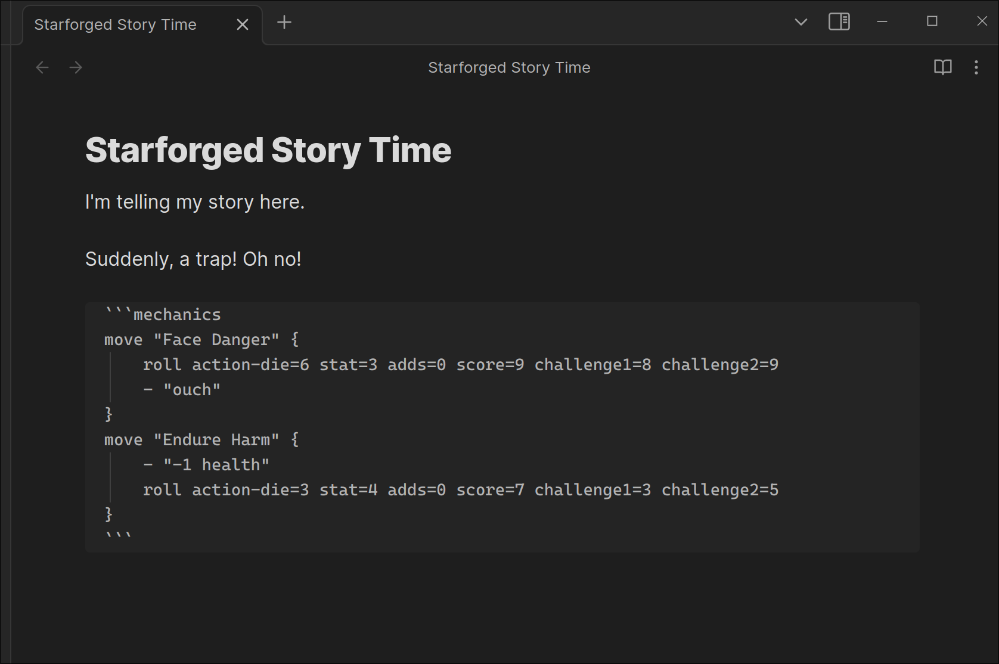
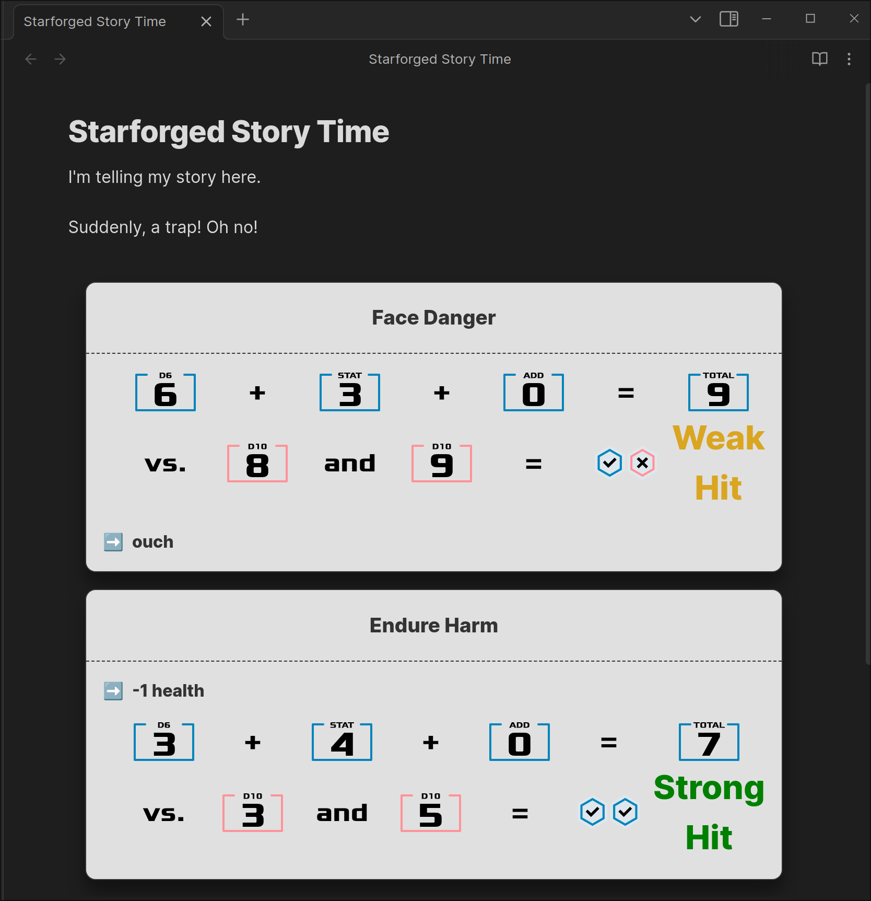

# Obsidian Forged

Obsidian plugin to play Ironsworn/Starforged system games, using the data in
[datasworn](https://github.com/rsek/datasworn) format.

This owes a lot to [Eric Bright's Forged_in_Obsidian](https://github.com/ericbright2002/Forged_in_Obsidian)
template vault. I started with that vault and then gradually replaced functionality
with this plugin.

## Features

See the test vault for examples of characters, progress tracks, clocks, etc. Also
see the [caveats](#caveats) for known issues/missing functionality.

- Pulls oracle, move, and asset data from datasworn files
  - Supplemental files can be added to the repo, to, e.g., add custom oracles
- Oracles
  - Roll on oracle tables with "Ask the Oracle" command
  - Generate complete entities (planets, NPCs, etc) using the "Generate an Entity" command
- Characters
  - Currently only supports one character (but built to eventually support multiple)
  - All character attributes are in YAML frontmatter
  - Use "Take on a Meter" / "Suffer on a Meter" commands to modify meters
- Moves
  - Trigger a move with the "Make a Move" command
    - Action rolls and progress rolls both supported and pull from character/progres track
      metadata
    - If your momentum could improve an action roll, you'll be prompted to burn momentum
  - Moves are rendered into custom move blocks as YAML/custom DSL
- Progress Tracks and Clocks: Each clock / progress track is kept in a file, using frontmatter
  to record progress, etc.

## Using the plugin

I don't yet have good instructions on setting things up-- but you'll basically
want a repository similar to the included `test-vault`.

To build the code and copy it to your vault, put the vault path in a `.targetdir`
file and then run: `pnpm install && pnpm copy:target`

You should then be able to enable the plugin in your vault (after
restarting/reloading Obsidian)

## Development

To play around, you can run `pnpm dev`, which watches for code changes, compiles,
and then deploys into the test vault. You can open up the test-vault in obsidian
and, with the hot-reload plugin enabled, new updates will be loaded automatically.

## Caveats

Biggest caveat is that this is a moving target and the file formats may change.
I have a bunch of stuff in the existing format, so I'm trying to be backwards
compatible.

A bunch of stuff is missing right now:

- I haven't tested with Ironsworn at all-- the Starforged data is bundled right now
  but eventually I'll make it a download?
- Asset meters aren't currently modifiable/rollable (but this is next up)
- Probably a dozen other signficant things I can't think of

### Mechanic Code Fences

This plugin renders a [KDL](https://kdl.dev/) block into a formatted
Ironsworn/Starforged mechanics block, with nice styling and all that.

It takes an Obsidian note that looks like this:



and turns it into this:



#### `move`

Declares a new move. A single ``mechanics`` block can contain multiple of
these nodes.

##### Arguments

- `moveName`: the name of the move

##### Example

````kdl
```mechanics
move "Face Danger" {
    roll action=6 stat=3 adds=0 vs1=8 vs2=9
    - "ouch"
}
move "Endure Harm" {
    - "-1 health"
    roll action=3 stat=4 adds=0 vs1=3 vs2=5
}
```
````

#### `-` (dash)

Adds an "arbitrary" text entry under the move. You can put anything in here.

Parent: `move`

##### Arguments

- `text`: the text to display

##### Example

```kdl
- "Oh man that was interesting"
- "+progress on the vow to get macdonalds"
```

#### `roll`

Adds a regular roll to the move.

Parent: `move`

##### Properties

- `action`: the value of the action die
- `stat`: the value of the stat to add
- `adds`: the total value of the adds
- `vs1`: the first challenge die
- `vs2`: the second challenge die

##### Example

```kdl
// This will be rendered as a Weak Hit
roll action-die=3 stat=2 adds=1 score=6 challenge1=3 challenge2=7
```

#### `progress-roll`

Adds a progress roll to the move.

Parent: `move`

##### Properties

- `score`: the number of filled track boxes the progress move is rolling against
- `vs1`: the first challenge die
- `vs2`: the second challenge die

##### Example

```kdl
// This will render as a Miss on progress
progress-roll score=5 challenge1=6 challenge2=7
```

#### `reroll`

Rerolls one or more dice from a previous roll in the same move. The move's
result will be automatically updated.

Parent: `move`

##### Properties

- `action` (optional): the new value of the action die
- `vs1` (optional): the new value of the first challenge die
- `vs2` (optional): the new value of the second challenge die

##### Example

```kdl
move "Face Danger" {
    // weak hit (score = 6)
    roll action=3 stat=2 adds=1 vs1=3 vs2=7

    // strong hit (score = 9)
    reroll action=6 vs1=5
}
```
